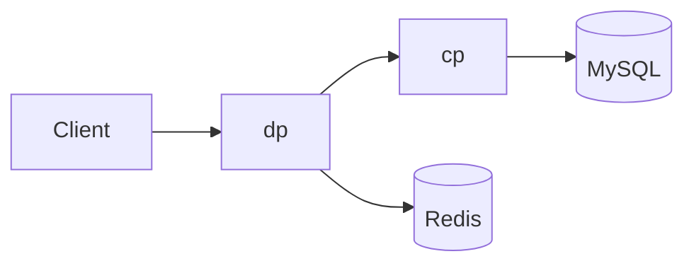
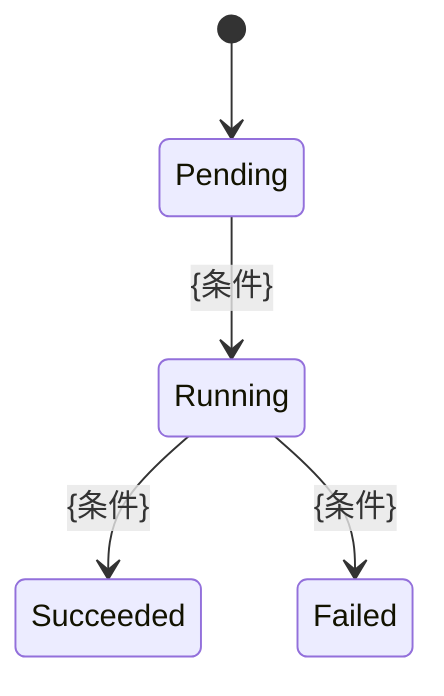

<!--
  Epic 文档模板 / Epic Document Template
  ======================================
  用法：
    1. 复制本文件为 epic-{N}-{slug}.md，编号在 Epic 目录下唯一且不回退（先查索引表格与现有文件）。
    2. 目录名必须与文件名严格一致：
         {epic_dir}/epic-{N}-{slug}.md
         {stories_dir}/epic-{N}-{slug}/
         {tasks_dir}/epic-{N}-{slug}/
       不允许 -v2、双横线等变体。
    3. 所有 HTML 注释与 {占位符} 在正式文档中必须删除或替换（【待下沉】注释除外，见第 6 条）。
    4. 标 [必备] 的章节不得省略；标 [可选] 的按触发条件保留或整节删除。
    5. 写完请过一遍文末《提交前自检清单》。
    6. 讨论中已确认、但属于代码 / 数据层的细节（字段取值约束、建表语句、缓存 value 结构、算法参数等），
       不写入正文，写在相关章节末尾的【待下沉】注释中暂存。注释以「【待下沉】→ Story {N}.{M}」开头
       （Story 未定写「→ Story 待定」），并写明：
         「后续编写详细设计文档时，将本注释内容复制到详细设计文档中，并删除 Epic 中的本注释。」
       注释内不得出现 HTML 注释结束符（mermaid 箭头请改写为 →）。
       【待下沉】注释不计入正文行数与代码围栏数。

  代码围栏 ≤ 10 个，且仅用于 mermaid 图与接口路径示例 —— Epic 内禁止贴实现代码
  （结构体定义 / 完整建表 SQL / 脚本全文 / 方法签名都属于 Story 或 Task）。

  本模板中的 {epic_dir} / {stories_dir} / {tasks_dir} 为目录占位，请按项目实际约定替换或删除对应行。
-->

# Epic {N}: {中文标题} ({English Title})

| 字段 | 值 |
|------|-----|
| 状态 | 规划中 / 进行中 / 已交付 / 已废弃 |
| 优先级 | 🔥 P0 / 🟡 P1 / 🟢 P2 |
| 负责人 | {PM 姓名} |
| 目标版本 | {vX.Y.Z 或 迭代名} |
| 前置依赖 | Epic {X}（{依赖原因}）；若无填「无」 |
| 被依赖 | Epic {X}（{被依赖原因}）；若无填「无」 |
| 涉及模块 | {cp / dp / common / service / sds / web-console …} |
| 关联原型 | {链接或「无」} |

---

## 1. 背景与业务价值 [必备]

<!-- 目标：让没参与讨论的人读完本节后同意「这事值得做」。
     只写「我们要支持 X」不算合格 —— 必须写清现状、痛点、不做的后果。 -->

### 1.1 现状
{当前是怎么做的？用哪个接口 / 哪张表 / 哪段流程？引用具体文件路径或接口路径。如果是完全的新功能，则需要说明该功能需要支持的场景。}

### 1.2 痛点
- {痛点 1：具体现象 + 影响面（哪类用户、多大规模、多高频率）}
- {痛点 2：不支持用户需求的场景}

### 1.3 不做的后果
{如果不做，会发生什么？可以是业务损失、安全风险、技术债累积速度、合规不满足。}

---

## 2. 目标与非目标 [必备]

<!-- 【MUST】非目标不是可选章节。它防的是范围蔓延，也防「我以为这个 epic 包含那个」。 -->

### 2.1 目标

<!-- 写「交付后可观测、可度量的结果」，不写功能清单。
     ✗ 反例：支持客户组级动态路由开关
     ✓ 正例：用户可以使用该功能达到什么效果
     ✓ 正例：平台管理员切换客户组开关后，配置在 ≤30 秒内于数据面生效 -->

- **G1**：{可度量目标}
- **G2**：{可度量目标}

### 2.2 非目标

<!-- 明确写出「本 Epic 不做，且后续也不打算通过本 Epic 做」的事项，并给出理由。
     只写「暂不支持」不给理由等于没写。 -->

- **NG1**：{不做的事} —— 理由：{为什么不做 / 留给哪个 Epic}
- **NG2**：{不做的事} —— 理由：{...}

---

## 3. 关键决策（已确认） [必备]

<!-- 编号 D1/D2/...，后续 Story / Task / Code Review / PR 一律引用编号。
     价值在于：① 避免同一问题在 Story 评审时被重新讨论；
              ② 记录「为什么不选另一个方案」—— 这是最容易丢、事后最常被追问的信息。
     未拍板的事项写进 §10「未决项」，不要混在本节。 -->

| # | 决策 | 选择 | 理由 | 被否决的方案及原因 |
|---|------|------|------|-------------------|
| D1 | {决策点} | **{选定方案}** | {理由} | {备选方案} —— {否决原因} |
| D2 | {决策点} | **{选定方案}** | {理由} | {备选方案} —— {否决原因} |

---

## 4. 范围边界 [必备]

<!-- 本节同时决定每个模块负责的部分、需要跑哪些跨模块 E2E。如果有新模块也需要在本次说明。 -->

| 模块 | 改动性质 | 一句话说明 |
|------|---------|-----------|
| cp | 新增 / 扩展 / 无改动 | {说明} |
| dp | 新增 / 扩展 / 无改动 | {说明} |
| common | 新增 / 扩展 / 无改动 | {说明；若改动，需说明各依赖模块的子模块同步方案} |
| service | 新增 / 扩展 / 无改动 | {说明} |
| sds | 新增 / 扩展 / 无改动 | {说明} |

---

## 5. 总体设计 [必备]

<!-- 本节只描述「形状」，不描述「实现」：
       整体流程图 → 泳道图，描述各个模块之间的交互
       数据模型 → 只列表名 / 字段名 / 类型 / 约束 / 索引，不贴结构体定义、不贴建表 SQL
       接口 → 只列 method + path + 用途，字段级契约属于独立的接口定义文件

     具体实现细节下沉到对应 Story 文档。 -->

本节开始前先写一段文字简单说明整体思路，并对后续出现的术语进行说明。如果涉及多模块分工也要说明每个模块的主要功能。

| 术语 | 说明 |
|------|------|
| **{术语}** | {定义} |

> 术语口径需与项目术语表保持一致；本 Epic 新引入的术语应同步收口到术语表。

### 5.1 整体流程总览



<!-- 图后补一段文字说明关键路径与数据落点。 -->

### 5.2 数据模型变更

**新增表**

| 表名 | 所属模块 | 用途 | 关键字段 | 索引 |
|------|---------|------|---------|------|
| `{table_name}` | cp | {用途} | {字段: 类型} | {索引} |

**修改表（仅加列，禁止改既有列语义）**

| 表名 | 新增列 | 类型 | 默认值 | 说明 |
|------|-------|------|-------|------|
| `{table_name}` | `{column}` | {类型} | {默认值} | {说明} |

<!-- 【MUST】禁止在数据库中使用外键（应用层维护关联关系）。
     【MUST】时间字段统一 UTC 存储，显示时转本地时间。 -->

**缓存 Key 设计**（涉及缓存时填写）

| Key 模式 | 数据结构 | TTL | 用途 |
|---------|---------|-----|------|
| `{key:pattern}` | {string/hash/zset} | {TTL} | {用途} |

### 5.3 接口变更

<!-- 只列改动项。字段级契约在独立的接口定义文件中维护，必须与代码实现保持一致。 -->

| 模块 | Method | Path | 用途 | 变更类型 |
|------|--------|------|------|---------|
| cp | POST | `/api/v1/...` | {用途} | 新增 / 扩展 |
| dp | POST | `/v1/...` | {用途} | 新增 / 扩展 |

**错误码**

| 错误码 | HTTP | 语义 | 触发条件 |
|-------|------|------|---------|
| `{code}` | {4xx/5xx} | {语义} | {条件} |

### 5.4 关键流程与状态机

<!-- 有复杂的异步任务、后台 Worker、定时清理、多状态流转时必填；线性流程可省略。如果比较简单可以描述在整体流程图中。
     新增的对象的生命周期或修改已有的对象的生命周期也可以填写。
     如果涉及系统中不同角色，则可以按角色画出该角色的数据流或操作流。
     用 mermaid stateDiagram 或文字描述状态与转移条件，不写实现。 -->



---

## 6. 架构影响评估 [必备]

<!-- 本节是「评估改动对整体架构的影响面」这条约束的落地位置。
     逐项回答，无影响也要显式写「无影响」，不能留空。 -->

### 6.1 控制面架构影响

| 层 | 是否新增/修改 | 说明 |
|----|--------------|------|
| Controller | 是 / 否 | {说明} |
| Service | 是 / 否 | {说明} |
| Cache | 是 / 否 | {说明；缓存键是否统一构建} |
| Model | 是 / 否 | {说明} |
| Repository | 是 / 否 | {说明；是否实现 Interface} |

> 【MUST】是否存在跨层访问？{是则说明原因与替代方案，否则写「无跨层访问」}
> 【MUST】是否增加新的线程或者定时器？{是则说明功能及影响，否则忽略}

### 6.2 数据面影响

- 请求处理链路顺序是否变更：{无 / 有，说明}
  > 【MUST】若链路顺序有既定约束，说明本改动是否触碰该约束。
- 是否影响请求中继路径延迟：{量级估算}
- 是否新增渠道类型 / 协议格式：{是 / 否}

### 6.3 中间件影响

- 是否新增新的中间件：Mysql / Redis 等。如果是的话则说明必要性。

### 6.4 性能与容量估算

| 指标 | 当前基线 | 本 Epic 后预估 | 验证方式 |
|------|---------|--------------|---------|
| 数据面 P99 延迟增量 | — | {< N ms} | {压测 / 观测} |
| QPS 承载 | {现有} | {预估} | {压测} |
| 缓存 key 数量级 | — | {量级} | {估算依据} |
| 内存增量 | — | {量级} | {估算依据} |

### 6.5 兼容性与回滚

- **向后兼容**：{是否兼容现有 API / 数据 / 客户端；若不兼容，迁移路径}
- **数据迁移**：{是否需要存量数据迁移；是否幂等；是否需要双写过渡期}
- **灰度策略**：{是否需要开关 / 分批；开关粒度与生效时延}
- **回滚方案**：{出问题后怎么退回去 —— 具体动作，不是「回滚版本」四个字}

### 6.6 需同步更新的文档

- [ ] `{architecture 文档}` —— {更新内容}
- [ ] `{术语表}` —— {新增/调整术语}
- [ ] 相关子模块的协作说明文件 —— {更新内容}

---

## 7. Story 拆分 [必备]

<!-- 每个 Story 只写三件事：一句话目标、交付物、前置依赖。详细设计在子文档目录下。 -->

| Story | 标题 | 负责模块 | 负责工种 | 前置 Story |
|-------|------|---------|---------|-----------|
| {N}.1 | {标题} | cp | BE | — |
| {N}.2 | {标题} | dp | BE | {N}.1 |
| {N}.3 | {标题} | web-console | FE | {N}.2 |
| {N}.4t | {标题} | e2e | QA | {N}.2, {N}.3 |

> 【MUST】每个开发 Story 必须有对应测试 Story（编号加 `t` 后缀）。

### 7.1 Story {N}.1：{标题}

<!-- 每个开发 Story 单独一个小节（7.1、7.2 …），测试 Story（t 后缀）不写描述。
     依次包含：用户故事、目标、核心、验收。下面是示例，正式文档中替换为实际内容。
       用户故事：As a / I want / So that 三行齐全，角色为业务角色
       目标：「维度：效果」，可追溯到 §2.1 的 G 编号
       核心：只写能力，不写表名 / 字段 / 接口路径
       验收：一行一条 WHEN … THEN …；每个目标至少一条；至少一条异常场景；THEN 必须可观测 -->

As a 租户管理员  
I want 通过已配置的分发令牌给租户空间内的用户分发数据面令牌  
So that 用户可以在安全管控下使用数据面令牌访问大模型

#### 目标
* 开发体验：简化租户内用户的令牌管理流程，减少一般用户的使用成本
* 安全管控：支持企业级的令牌分发及精细管控，实现令牌精确到用户
* 访问审计：支持追踪及分析每个用户的使用情况

#### 核心
* 租户管理员可以给租户用户分配、禁用数据面令牌
* 租户用户可以查看分配给自己的数据面令牌，并重新生成令牌密钥
* 数据面令牌的每次使用都可以追溯到具体的租户用户

#### 验收
WHEN 租户管理员给租户用户分配令牌 THEN 该用户在令牌列表中立即可见该令牌，状态为启用，且无需自行配置即可使用该令牌访问大模型  
WHEN 租户用户获取新的数据面令牌密钥 THEN 返回新生成的随机密钥，旧密钥立即失效，且数据表中不保存该密钥明文  
WHEN 租户管理员禁用某用户的令牌 THEN 该用户使用该令牌访问数据面的请求被拒绝，并返回令牌已禁用的错误码  
WHEN 非租户管理员角色尝试给其他用户分配令牌 THEN 请求被拒绝并返回无权限错误码，且不产生新令牌  
WHEN 租户用户使用数据面令牌访问大模型 THEN 租户管理员可在使用记录中按该用户查询到本次请求的时间、模型与用量

---

## 8. Story 依赖关系图 [必备]

```mermaid
graph TD
    S1[{N}.1 数据层] --> S2[{N}.2 服务层]
    S2 --> S3[{N}.3 前端]
    S2 --> S4[{N}.4t E2E]
```

<!-- 图的作用是让排期的人一眼看出关键路径。 -->

---

## 9. 风险与缓解 [必备]

| # | 风险 | 影响 | 概率 | 缓解措施 | 触发后的回滚动作 |
|---|------|------|:----:|---------|----------------|
| R1 | {风险} | {影响面} | 高/中/低 | {具体措施，禁止写「加强测试」} | {具体动作} |
| R2 | {风险} | {影响面} | 高/中/低 | {措施} | {动作} |

---

## 10. 未决项 [必备，无则写「无」]

<!-- 尚未拍板、需要某个时间点前确认的事项。每项必须有 Owner 和截止时间，否则等于没有。 -->

| # | 待确认事项 | Owner | 需在何时前确认 | 影响 |
|---|-----------|-------|--------------|------|
| Q1 | {事项} | {姓名} | {Story {N}.{M} 开始前} | {不确认会阻塞什么} |

---

## 11. 验收准则（Epic 级） [必备]

<!-- 这里是 Epic 级验收，不是 Story 级。Story 级验收在各自 story 文档里。 -->

### 11.1 功能验收

- [ ] {验收项，对应 §2.1 的 G1}
- [ ] {验收项，对应 §2.1 的 G2}

### 11.2 性能验收

- [ ] 请求中继路径 P99 延迟增量 < {N} ms（{验证方式}）
- [ ] {QPS / 并发 / 吞吐指标}
- [ ] {资源占用指标}

### 11.3 兼容性验收

- [ ] {现有 API / 客户端 / 数据兼容性验证项}
- [ ] 存量数据迁移验证：{验证方式}

### 11.4 安全与合规验收

- [ ] 多租户数据隔离：{验证项}
- [ ] 权限校验：{验证项}
- [ ] 审计日志完整性：{验证项}

### 11.5 E2E 验收

- [ ] `{e2e 测试脚本路径}` 通过
- [ ] {既有 e2e 回归项}

### 11.6 工程验收

- [ ] 编译通过（`{构建命令}`）
- [ ] 单元测试全部通过（`{测试命令}`）
- [ ] 前端构建 / 静态检查无错误（涉及前端时）
- [ ] 接口定义文件与代码实现一致

---

## 12. 配套文档 [必备]

| 类型 | 路径 |
|------|------|
| Story | `{epic_dir}/../stories/epic-{N}-{slug}/` |
| Task | `{epic_dir}/../tasks/epic-{N}-{slug}/` |
| 接口定义 | `{接口定义文件路径}` |
| 架构文档 | `{架构文档路径}` |
| E2E 测试 | `{e2e 脚本路径}` |
| 原型 / 设计稿 | {链接} |

---

<!--
  ============ 可选章节（按触发条件保留或整节删除） ============
  把需要的整节复制到 §11 之前，不需要的直接删掉。不要每篇都写，否则稀释信号。

## X. 迁移策略 [触发：有存量数据或行为变更]
### X.1 迁移阶段划分
### X.2 回滚点与判据
### X.3 幂等性保证

## X. 计费与成本口径 [触发：涉及计费/定价]
### X.1 计费公式
### X.2 定价数据来源与版本化
### X.3 与对账侧口径的对齐
### X.4 折扣解析兜底链

## X. 可观测性 [触发：后台任务 / 需线上排障]
### X.1 Metrics 指标清单（指标名 / 类型 / 标签）
### X.2 日志字段与级别
### X.3 告警规则与阈值

## X. 用户角色与权限矩阵 [触发：平台侧功能]
### X.1 角色定义
### X.2 页面/接口 × 角色权限矩阵

## X. 前端信息架构与页面清单 [触发：有 Web 控制台改动]
### X.1 导航结构终态
### X.2 页面清单（页面 / 路由 / 主要交互）
### X.3 组件复用说明
-->

<!--
  ============ 提交前自检清单 ============
  [ ] 编号在 Epic 目录下唯一，未与既有 epic 冲突；未跳号
  [ ] 文件名 slug 与同级子文档目录名严格一致（无 -v2、无双横线等变体）
  [ ] 文档索引的 Epic 表格已同步新增/更新本行，链接可点击且指向存在的文件
  [ ] 所有 [必备] 章节均已填写，无 {占位符} 残留
  [ ] §2.2 非目标至少 3 条，每条都有理由
  [ ] §3 关键决策已编号，后续 Story/Task 引用这些编号
  [ ] §6 架构影响评估逐项作答，无影响处显式写「无影响」
  [ ] §6.5 回滚方案是具体动作，不是「回滚版本」
  [ ] §7.x 每个开发 Story 有独立描述小节（含用户故事 / 目标 / 核心 / 验收），核心只写能力，验收为 WHEN/THEN 且覆盖每条目标及至少一条异常场景
  [ ] §10 未决项每项都有 Owner 和截止时间
  [ ] §11.5 E2E 验收列出了具体脚本
  [ ] 正文行数在 300–800 之间；代码围栏 ≤ 10 个
  [ ] 全文无实现代码（无结构体定义、无完整建表 SQL、无脚本全文、无方法签名）
  [ ] 讨论中确认的代码 / 数据层细节已放入【待下沉】注释，且每条标明目标 Story；详细设计文档写完后已迁移并删除
  [ ] 章节标题格式统一（编号方式、冒号全/半角、emoji 使用与否全文一致）
  [ ] 需求变更时已回写本 Epic 的 §3/§4，而非只改 Story
-->
